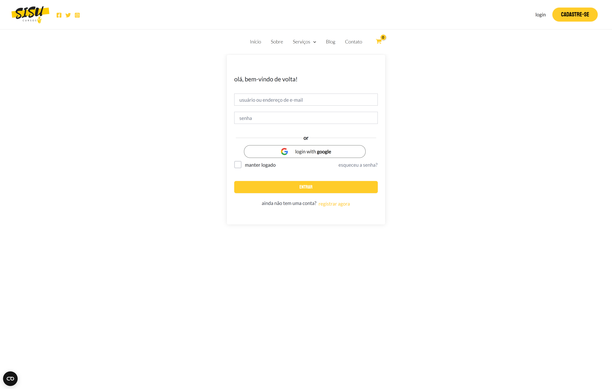

# Sisu Cursos

**Sisu Cursos** is an online learning platform developed by two Brazilian teachers who are fluent in Finnish. The website is powered by WordPress and utilizes Tutor LMS for course management, WooCommerce for e-commerce functionality, and various plugins for additional features. Our goal is to provide high-quality Finnish language courses for Brazilian students.

## Overview

- **Project Name**: Sisu Cursos
- **Platform**: WordPress
- **Primary Plugins**:
  - **Tutor LMS**: Used for creating and managing online courses.
  - **WooCommerce**: Powers the store for selling courses and other educational materials.
  - **Various utility plugins**: Plugins like Backuply, MailPoet, and Google for WooCommerce enhance functionality and security.

The site offers a variety of Finnish language courses and resources, tailored for Brazilian students. It allows easy registration, payment, and course management through a simple and intuitive interface.

## Features

- **Online Courses**: Finnish language courses designed for Brazilian learners.
- **Course Management**: Use of Tutor LMS for creating, managing, and tracking student progress.
- **E-commerce Integration**: WooCommerce powers the purchasing and payment system.
- **Multilingual Support**: The site supports both Portuguese (Brazil) and Finnish languages.
- **Backup and Security**: Backuply ensures regular backups for safety.

## Key Plugins Used

- **Tutor LMS**: A powerful plugin for building a Learning Management System (LMS) in WordPress.
- **WooCommerce**: A comprehensive e-commerce plugin used to handle transactions and course sales.
- **Stripe for WooCommerce**: Enables secure online payment processing.
- **MailPoet**: Allows for email marketing, newsletters, and notifications to students.
- **Google for WooCommerce**: Integration with Google for product listings and tracking.

## Customizations

- **Custom CSS**: Minor customizations were made to enhance the visual appeal of the theme and plugins.
- **Payment Gateways**: Integrated Stripe for WooCommerce to allow secure payment options.
- **Course Structure**: Courses are organized by difficulty and type (e.g., Beginner, Intermediate, Advanced).

## Getting Started

To run a similar project or clone the setup, follow these steps:

1. **Install WordPress**: Ensure that you have WordPress installed and running.
2. **Install Required Plugins**: Download and activate the following plugins:
   - Tutor LMS
   - WooCommerce
   - Stripe for WooCommerce
   - MailPoet
   - Backuply and other utility plugins
3. **Setup Courses**: Use Tutor LMS to create and manage courses.
4. **Customize Appearance**: Apply any necessary theme customizations (CSS, layout).
5. **Enable E-commerce**: Set up WooCommerce and configure payment methods.

## Screenshots

*The homepage showcasing the available courses and registration options.*

*Example of a course page with course content and purchase options.*

*Signup page where users can register for the courses.*

*Login page for returning users to access their courses.*

*The website’s responsiveness across various devices.*

*Detailed view of a specific course with content, pricing, and purchase options.*

## Future Plans

- **Expand Course Offerings**: Add more Finnish language courses for different levels.
- **Live Classes**: Implement live classes or tutoring sessions.
- **Mobile App**: Develop a mobile app for a more accessible learning experience.

## Contributors

- **Arthur Ferreira Miranda**: Co-founder and lead developer of the website.
- **Douglas Pereira Freitas**: Co-founder and course content creator.

## License

This project is licensed under the MIT License - see the [LICENSE](LICENSE) file for details.
